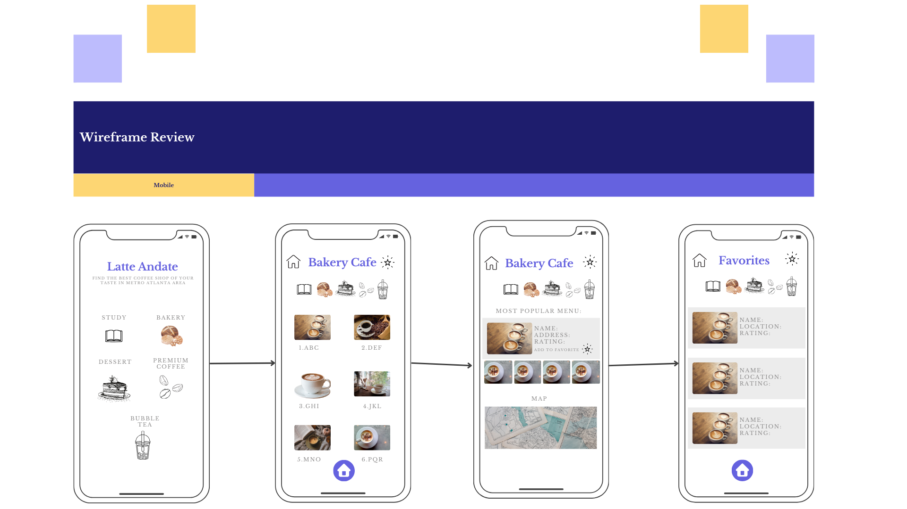
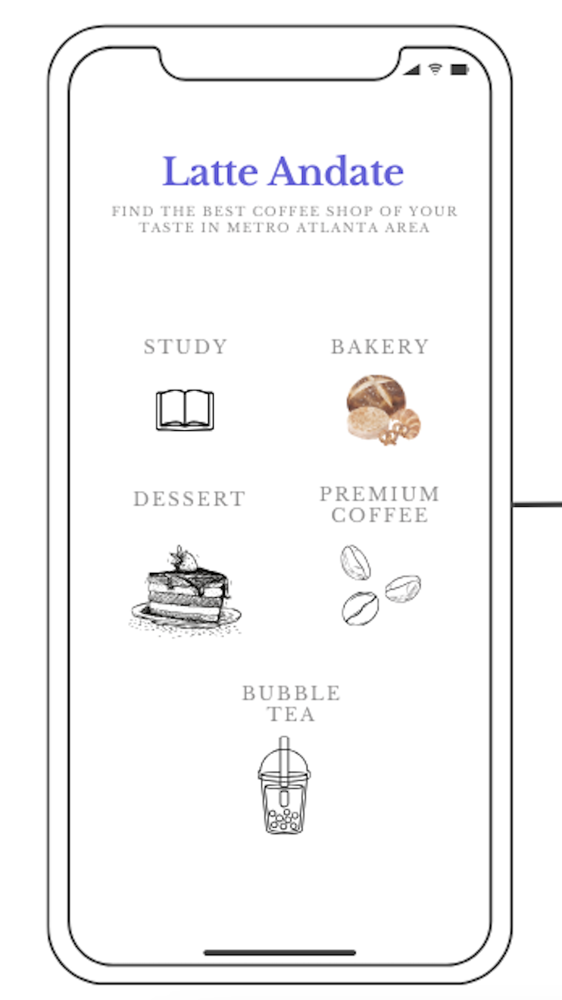
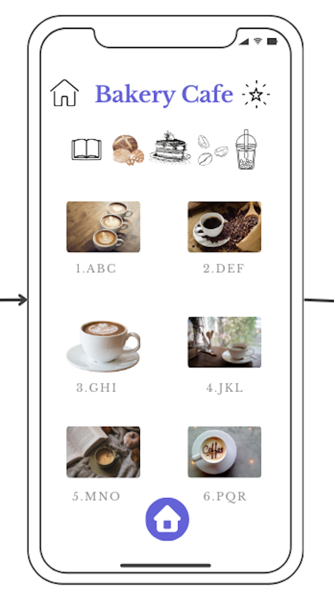
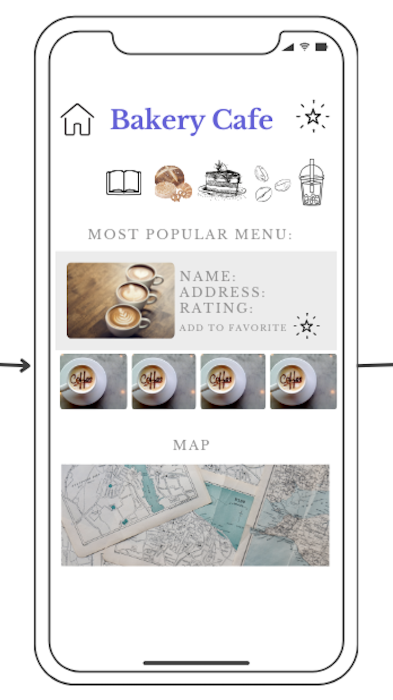
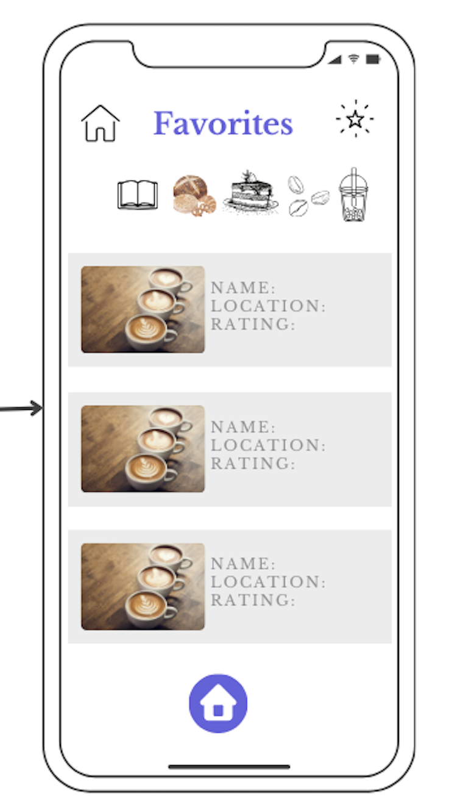

# Latte-Andante-Mobile-App
<h2>Introducing The Best Local Coffee Shops in Metro ATL</h2>

LATTE ANDANTE is a fullstack mobile app that enables the end users to search for a coffee shop in metro Atlanta area by their choice of interest.
There are five categories of interests to choose from - Study, Bakery, Dessert, Premium Coffee, and Bubble Tea.
All of the data will be pulled from the database through the Axios call and Express.
 
 

Once the user selects the category, a list of coffee shops will generate and users can view the lists of coffee shops of that falls under the selected category.
The name of the selected category will display on the top. The home icon is the button that takes you back to the main page. The star icon on upper right corner is linked to the "Favorites" page, and users can change the choice of catogory by clicking on the 5 category items on top of the page.

By clicking on any one of the coffee shops, users can view the details of the selected coffee shop with information including the store name, address, and the most popular menu.
Right underneath, users can view more pictures of the coffee shops and its menus. Users are also able to add the stores to their favorites by clicking on the "favorites" icon.
Down below is a linked google map, and by clicking on the map, users will be redirected to google maps page.

Lastly the favorties page will dipslay the list of favorited coffee shops of the users choice, and by clikcing on each choices, the page will be redirected to the details page of the coffee shop where you can see the pictures and location in the map.

